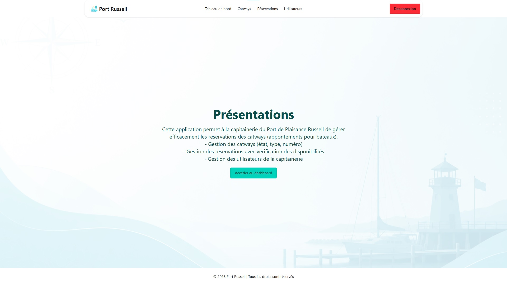
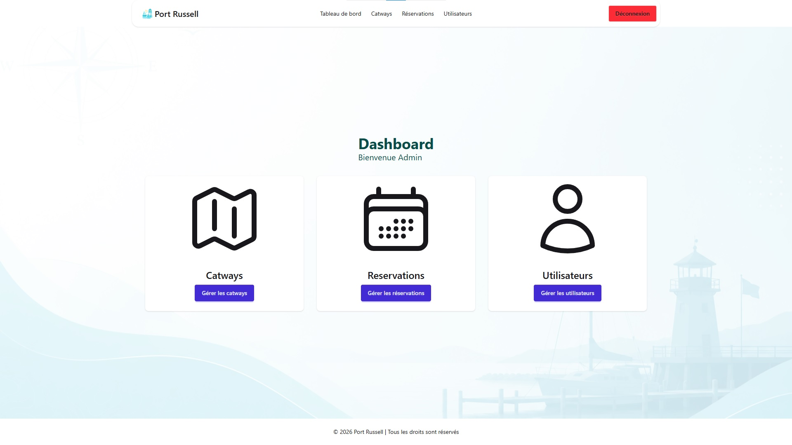
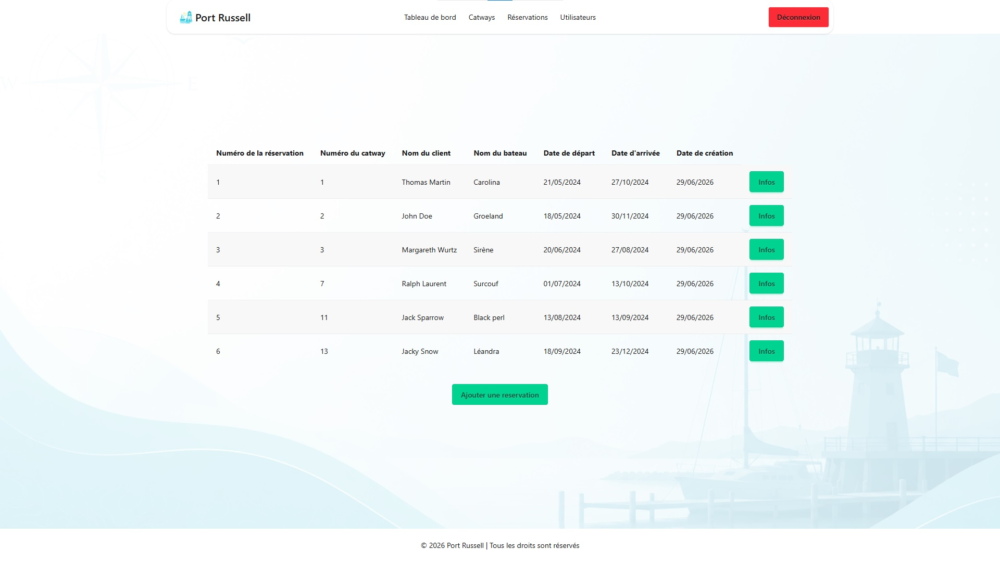
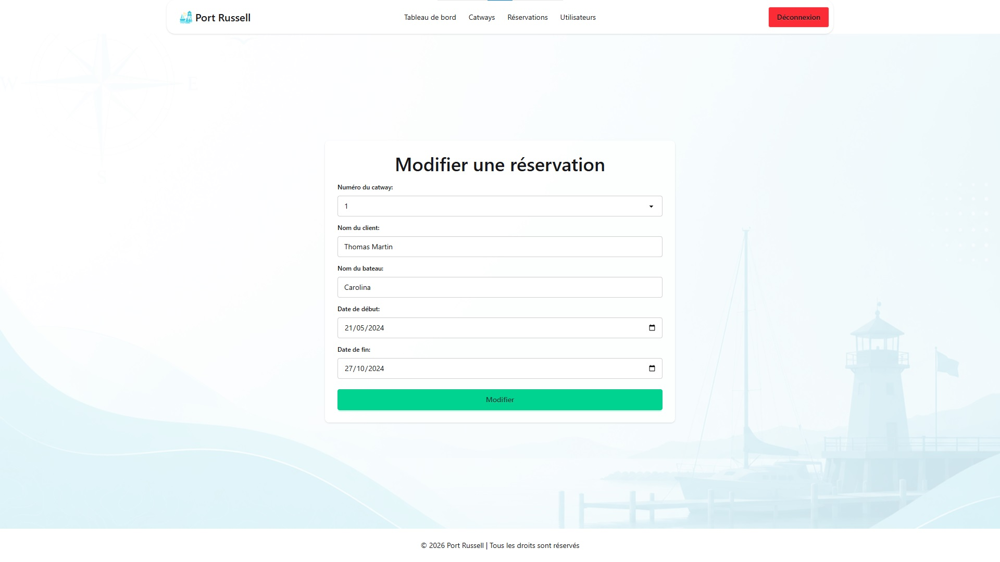
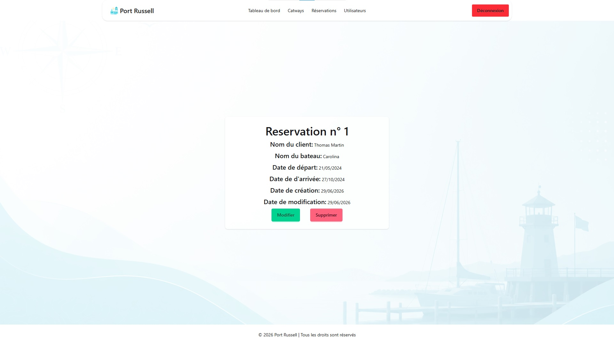

# ⚓ Port Russell

Application web de gestion des réservations pour la capitainerie du Port de Plaisance Russell.

Ce projet est une réécriture, en Laravel, d'un projet initialement développé avec Express et MongoDB. L'objectif était de retravailler la même logique métier avec une stack différente, en appliquant les conventions et bonnes pratiques propres à l'écosystème Laravel.

## Fonctionnalités

- **Gestion des catways** (appontements pour bateaux) : numéro, type (short / long), état
- **Gestion des réservations** : client, bateau, dates, avec vérification automatique de la disponibilité du catway sur la période demandée
- **Gestion des utilisateurs** : seuls les comptes administrateurs peuvent créer, modifier ou supprimer des utilisateurs
- **Authentification** : connexion sécurisée, pas d'inscription publique - les comptes sont créés uniquement par un administrateur
- **Routes protégées** : accès réservé aux utilisateurs connectés, avec un middleware dédié pour les sections réservées aux administrateurs

## Stack technique

- **Backend** : Laravel
- **Base de données** : SQLite
- **Frontend** : Blade, Tailwind CSS, DaisyUI

## Aperçu

### Page d'accueil



### Tableau de bord



<details>
<summary>Voir le détail du CRUD Réservations (même structure pour Catways et Utilisateurs)</summary>

#### Liste des réservations



#### Ajouter une réservation


#### Modifier une réservation



#### Détail d'une réservation



</details>

## Installation locale

```bash
# Cloner le dépôt
git clone https://github.com/guillaumebertil/port-russell-v2.git
cd port-russell-v2

# Installer les dépendances PHP
composer install

# Installer les dépendances front
npm install

# Configurer l'environnement
cp .env.example .env
php artisan key:generate

# Créer la base de données SQLite
touch database/database.sqlite

# Lancer les migrations et alimenter la base
php artisan migrate --seed

# Compiler les assets
npm run build

# Lancer le serveur
php artisan serve
```

Un compte administrateur doit être créé manuellement via Tinker pour accéder à l'application :

```bash
php artisan tinker
```

```php
User::create([
    'name' => 'Admin',
    'email' => 'admin@example.com',
    'password' => Hash::make('password'),
    'isAdmin' => true,
]);
```
